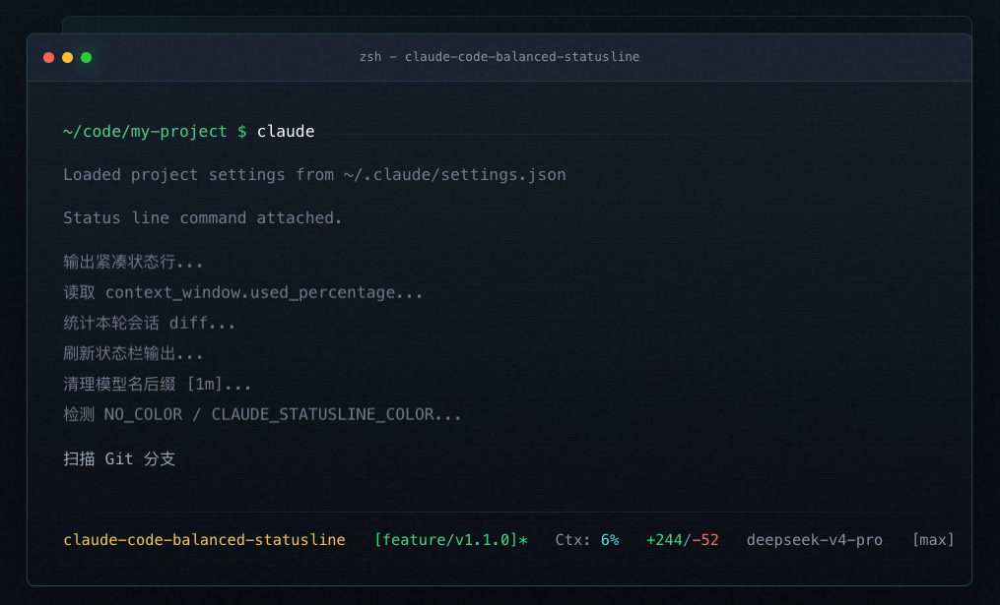

# Claude Code Balanced Statusline

把项目、分支、上下文用量、变更量、模型和 effort 档位压进一条高密度状态行。
足够克制，足够醒目，适合一直挂在终端底部。

👉 [项目主页](https://qipeijun.github.io/claude-code-balanced-statusline/)



```text
claude-code-balanced-statusline  [feature/v1.1.0]*  Ctx: 3%  +1/-0  deepseek-v4-pro  [max]
```

## 快速开始

```bash
curl -fsSL https://raw.githubusercontent.com/qipeijun/claude-code-balanced-statusline/main/install.sh | bash
```

前提：已安装 `jq`。macOS 上 `brew install jq`，其他系统用对应包管理器。Git 可选，没有也不报错。

## 状态栏字段

| 字段 | 颜色 | 说明 |
|------|------|------|
| 项目目录 | 黄 | 当前工作目录名 |
| Git 分支 | 绿 | `*` 表示工作区有未提交修改 |
| Ctx: N% | 青 / 黄 / 红 | 上下文用量：<50% 青，50-79% 黄，≥80% 红 |
| +N/-N | 绿 / 红 | 本轮会话新增与删除行数 |
| 模型名 | 灰 | 自动去掉 `[1m]` 等 provider 尾缀 |
| [effort] | 灰 | 仅非 `medium` 时显示 |

## 安装

**一行安装**（推荐）：

```bash
curl -fsSL https://raw.githubusercontent.com/qipeijun/claude-code-balanced-statusline/main/install.sh | bash
```

Windows：

```powershell
powershell -c "irm https://raw.githubusercontent.com/qipeijun/claude-code-balanced-statusline/main/install.ps1 | iex"
```

安装器会自动备份旧文件，只追加 `statusLine` 配置到 `~/.claude/settings.json`，不动你已有的其他字段。

**手动安装**：

```bash
mkdir -p ~/.claude
cp statusline.sh ~/.claude/statusline.sh
chmod +x ~/.claude/statusline.sh
```

然后在 `~/.claude/settings.json` 中加上：

```json
{
  "statusLine": {
    "type": "command",
    "command": "~/.claude/statusline.sh"
  }
}
```

## 环境变量

| 变量 | 效果 |
|------|------|
| `CLAUDE_STATUSLINE_SHOW_HOST=1` | 在目录名前显示 `user@hostname` |
| `NO_COLOR=1` | 关闭 ANSI 颜色 |
| `CLAUDE_STATUSLINE_COLOR=0` | 同上 |

## 本地测试

```bash
echo '{"model":{"display_name":"deepseek-v4-pro[1m]"},"context_window":{"used_percentage":3},"cost":{"total_lines_added":1,"total_lines_removed":0},"effort":{"level":"max"}}' | ./statusline.sh
```

去掉颜色看纯文本：

```bash
echo '{"model":{"display_name":"deepseek-v4-pro[1m]"},"context_window":{"used_percentage":3},"cost":{"total_lines_added":1,"total_lines_removed":0},"effort":{"level":"max"}}' | ./statusline.sh | perl -pe 's/\e\[[0-9;]*m//g'
```

预期输出：

```text
claude-code-balanced-statusline  Ctx: 3%  +1/-0  deepseek-v4-pro  [max]
```

在 Git 仓库内运行时还会显示分支名。

## License

MIT
